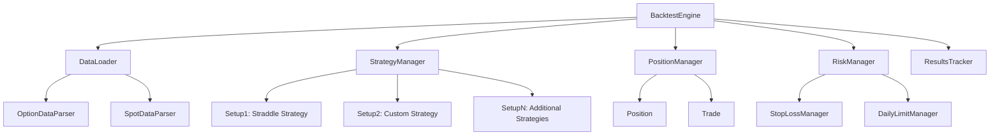

# Design Document

## Overview

The Options Backtesting Engine is designed to process 0DTE intraday options trading strategies using 5-second resolution historical data. The system iterates through multiple trading days, manages multiple trading setups simultaneously, and provides comprehensive position management with real-time P&L tracking.

## Architecture

### High-Level Components



## Components and Interfaces

### 1. BacktestEngine (Main Orchestrator)

**Purpose**: Main controller that orchestrates the entire backtesting process across multiple dates.

**Key Responsibilities**:
- Load and iterate through multiple date files (2025-08-13_BK.csv, 2025-08-14_BK.csv, etc.)
- Coordinate 5-second interval processing with this core flow:
  1. Start iteration with no positions
  2. Check if any setups match entry conditions
  3. If entry triggered, iterate through option chain to add new positions for that setup
  4. Check P&L for all existing positions (each setup may have different P&L logic)
  5. Close positions based on target/SL/timeindex
  6. At jobEndIdx: force close all remaining open positions
- Manage end-of-day cleanup: close positions, calculate daily P&L, update cumulative stats
- Reset positions between trading days and update total P&L, win rate, drawdown
- Aggregate results across all trading days

**Interface**:
```python
class BacktestEngine:
    def __init__(self, data_path: str, setups: List[TradingSetup])
    def run_backtest(self, start_date: str, end_date: str) -> BacktestResults
    def process_trading_day(self, date: str) -> DailyResults
    def process_time_interval(self, timestamp: int, option_data: Dict, spot_price: float):
        # Core iteration logic:
        # 1. Check entry conditions for all setups
        # 2. Create new positions if entry triggered
        # 3. Update P&L for existing positions
        # 4. Check exit conditions (target/SL/timeindex)
        # 5. If timestamp == jobEndIdx, force close all open positions
    def end_of_day_cleanup(self, job_end_idx: int) -> DailyResults
    def reset_daily_positions(self)  # Clear all positions for next day
    def update_cumulative_stats(self, daily_pnl: float, trades: List[Trade])  # Update total P&L, win rate, drawdown
    def check_daily_risk_limits(self) -> bool  # Coordinates with RiskManager

```

### 2. DataLoader

**Purpose**: Unified data loading and parsing for option chains and spot prices.

**Key Responsibilities**:
- Load option data files for specified date range
- Parse spot price data to determine current underlying price
- Provide efficient strike selection (10-15 strikes near spot)
- Enable direct LTP lookup for existing positions

**Interface**:
```python
class DataLoader:
    def load_trading_day(self, symbol: str, date: str) -> TradingDayData
    def get_available_dates(self, symbol: str) -> List[str]
    def get_strikes_near_spot(self, spot_price: float, num_strikes: int = 15) -> List[float]
    def get_option_price(self, timestamp: int, option_type: str, strike: float) -> float
```

### 3. TradingDayData

**Purpose**: Container for all data related to a single trading day.

**Structure**:
```python
class TradingDayData:
    date: str
    spot_data: Dict[int, float]  # timestamp -> spot_price
    option_data: Dict[int, Dict[str, Dict[float, float]]]  # timestamp -> {CE/PE -> {strike -> price}}
    job_end_idx: int  # from .prop file - last valid timeindex for the day
    metadata: Dict  # other data from .prop file
```

### 4. StrategyManager

**Purpose**: Manages multiple trading setups and their execution logic.

**Key Responsibilities**:
- Coordinate multiple setups (Setup1, Setup2, etc.)
- Check entry conditions for each setup
- Trigger position opening when conditions are met

**Interface**:
```python
class StrategyManager:
    def __init__(self, setups: List[TradingSetup])
    def check_entry_signals(self, market_data: MarketData) -> List[TradeSignal]
    def add_setup(self, setup: TradingSetup)
```

### 5. TradingSetup (Abstract Base)

**Purpose**: Base class for different trading strategies.

**Strike Selection Methods**:
- **Premium-based**: Iterate from OTM to ITM, select strikes with premium >= scalping_price (e.g., 0.40)
- **Distance-based**: Select strikes N positions away from spot (e.g., 2-3 strikes away)

**Example Implementation**:
```python
class StraddleSetup(TradingSetup):
    def __init__(self, target_pct: float, stop_loss_pct: float, entry_timeindex: int,
                 close_timeindex: int = 4650, strike_selection: str = "premium",
                 scalping_price: float = 0.40, strikes_away: int = 2)
    def check_entry_condition(self, current_timeindex: int) -> bool
    def select_strikes(self, spot_price: float, option_chain: Dict) -> Dict[str, float]
    def create_positions(self, market_data: MarketData) -> List[Position]
    def should_force_close(self, current_timeindex: int) -> bool
```

### 6. PositionManager

**Purpose**: Tracks all open positions and calculates real-time P&L.

**Key Responsibilities**:
- Maintain active positions across all setups
- Calculate current P&L using live option prices
- Calculate P&L for each setup (different logic per setup - selling, buying, spreads)
- Check individual position target and stop-loss conditions
- Check time-based closure conditions for each setup
- Execute individual position closures (target/SL/time-based)
- Provide total P&L data to RiskManager for daily limit checks

**Interface**:
```python
class PositionManager:
    def add_position(self, position: Position)
    def update_positions(self, market_data: MarketData) -> List[ClosedPosition]
    def check_time_based_closures(self, current_timeindex: int, setups: List[TradingSetup]) -> List[ClosedPosition]
    def get_total_pnl(self) -> float
    def get_setup_pnl(self, setup_id: str) -> float
    def close_all_positions(self, market_data: MarketData) -> List[ClosedPosition]
    def close_setup_positions(self, setup_id: str, market_data: MarketData) -> List[ClosedPosition]
    def force_close_at_job_end(self, job_end_idx: int, market_data: MarketData) -> List[ClosedPosition]
    def reset_positions(self)  # Clear all positions for new trading day
```

### 7. Position

**Purpose**: Represents a single options position (e.g., short straddle).

**P&L Calculation**:
- **Selling**: P&L = (entry_price - current_price) * quantity * lot_size - slippage
- **Buying**: P&L = (current_price - entry_price) * quantity * lot_size - slippage
- **Slippage**: 0.005 applied on entry and exit

**Structure**:
```python
class Position:
    setup_id: str
    entry_timeindex: int
    entry_prices: Dict[str, float]  # {option_key -> entry_price_with_slippage}
    strikes: Dict[str, float]  # {option_type -> strike}
    quantity: int
    lot_size: int = 100
    target_pnl: float
    stop_loss_pnl: float
    current_pnl: float
    position_type: str  # "SELL" or "BUY"
    force_close_timeindex: int
    slippage: float = 0.005
```

### 8. RiskManager

**Purpose**: Implements risk controls and daily limits.

**Key Responsibilities**:
- Monitor total daily P&L received from PositionManager
- Check if daily maximum loss limit is breached
- Trigger emergency closure of ALL positions when daily max SL hit
- Coordinate with PositionManager to execute mass position closure

**Interface**:
```python
class RiskManager:
    def __init__(self, daily_max_loss: float)
    def check_daily_limit(self, current_pnl: float) -> bool
    def should_close_all_positions(self, total_pnl: float) -> bool
```

## Data Models

### MarketData
```python
class MarketData:
    timestamp: int
    spot_price: float
    option_prices: Dict[str, Dict[float, float]]  # {CE/PE -> {strike -> price}}
    available_strikes: List[float]
```

### TradeSignal
```python
class TradeSignal:
    setup_id: str
    signal_type: str  # 'OPEN', 'CLOSE'
    positions_to_create: List[Position]
    positions_to_close: List[str]  # position_ids
```

### BacktestResults
```python
class BacktestResults:
    total_pnl: float
    daily_results: List[DailyResults]
    trade_log: List[Trade]
    setup_performance: Dict[str, SetupResults]
    win_rate: float
    max_drawdown: float
    total_trades: int

class DailyResults:
    date: str
    daily_pnl: float
    trades_count: int
    positions_forced_closed_at_job_end: int
    setup_pnls: Dict[str, float]
```

## Error Handling

### Data Validation
- Validate file existence for each trading day
- Handle missing option prices gracefully
- Skip corrupted data points with logging

### Position Management
- Handle option price lookup failures
- Manage positions when strikes become unavailable
- Implement fallback pricing mechanisms

### Risk Controls
- Emergency position closure on system errors
- Graceful handling of end-of-day scenarios
- Validation of P&L calculations

## Testing Strategy

### Unit Tests
- Individual component testing (DataLoader, PositionManager, etc.)
- Mock data generation for isolated testing
- Edge case handling validation

### Integration Tests
- End-to-end backtesting with sample data
- Multi-day processing validation
- Risk management trigger testing

### Performance Tests
- Large dataset processing benchmarks
- Memory usage optimization validation
- Real-time processing speed tests