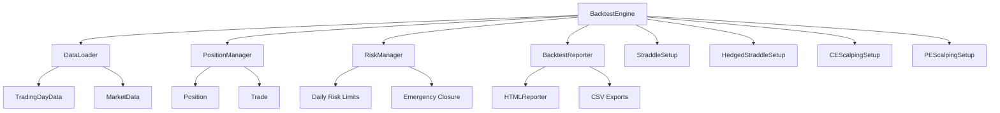

# Design Document

## Overview

The Options Backtesting Engine is a comprehensive system designed to process 0DTE intraday options trading strategies using 5-second resolution historical data. The system supports multiple sophisticated strategy types (straddles, hedged positions, scalping with re-entry), manages complex position structures, and provides advanced analytics and reporting capabilities.

## Architecture

### High-Level Components



## Components and Interfaces

### 1. BacktestEngine (Main Orchestrator)

**Purpose**: Main controller that orchestrates the entire backtesting process across multiple dates and coordinates all strategy executions.

**Key Responsibilities**:
- Load and iterate through multiple date files (2025-08-13_BK.csv, 2025-08-14_BK.csv, etc.)
- Coordinate 5-second interval processing with this core flow:
  1. Start iteration with no positions
  2. Check if any setups match entry conditions (including re-entry logic)
  3. If entry triggered, create new positions based on strategy-specific logic
  4. Update P&L for all existing positions using live option prices with slippage
  5. Close positions based on target/SL/timeindex/daily limits
  6. At jobEndIdx: force close all remaining open positions
- Manage end-of-day cleanup: close positions, calculate daily P&L, reset strategy states
- Reset positions between trading days and update cumulative statistics
- Generate comprehensive results with detailed analytics

**Interface**:
```python
class BacktestEngine:
    def __init__(self, data_path: str, setups: List[TradingSetup], daily_max_loss: float = 1000.0)
    def run_backtest(self, symbol: str, start_date: str, end_date: str) -> BacktestResults
    def process_trading_day(self, symbol: str, date: str) -> Optional[DailyResults]
    def process_time_interval(self, market_data: MarketData, date: str = "") -> List[Trade]
    def check_daily_risk_limits(self) -> bool
    def _generate_final_results(self) -> BacktestResults
    def _calculate_max_drawdown(self) -> float
```

### 2. DataLoader

**Purpose**: Unified data loading and parsing for option chains, spot prices, and trading session metadata.

**Key Responsibilities**:
- Load option data files for specified date range with error handling
- Parse spot price data from OHLC format to determine current underlying price
- Load metadata from .prop files including jobEndIdx and session parameters
- Provide efficient strike selection (10-15 strikes near spot)
- Enable direct LTP lookup for existing positions with graceful handling of missing data

**Interface**:
```python
class DataLoader:
    def __init__(self, data_path: str = "5SecData")
    def get_available_dates(self, symbol: str) -> List[str]
    def load_trading_day(self, symbol: str, date: str) -> Optional[TradingDayData]
    def get_strikes_near_spot(self, spot_price: float, option_chain: Dict, num_strikes: int = 15) -> List[float]
    def get_option_price(self, option_data: Dict, timestamp: int, option_type: str, strike: float) -> Optional[float]
    def _parse_option_data(self, file_path: str) -> Dict[int, Dict[str, Dict[float, float]]]
    def _parse_spot_data(self, file_path: str, target_date: str) -> Dict[int, float]
    def _parse_prop_file(self, file_path: str) -> Dict
```

### 3. TradingDayData & MarketData

**Purpose**: Data containers for trading session and real-time market data.

**Structure**:
```python
@dataclass
class TradingDayData:
    date: str
    spot_data: Dict[int, float]  # timestamp -> spot_price
    option_data: Dict[int, Dict[str, Dict[float, float]]]  # timestamp -> {CE/PE -> {strike -> price}}
    job_end_idx: int  # from .prop file - last valid timeindex for the day
    metadata: Dict  # other data from .prop file

@dataclass
class MarketData:
    timestamp: int
    spot_price: float
    option_prices: Dict[str, Dict[float, float]]  # {CE/PE -> {strike -> price}}
    available_strikes: List[float]
```

### 4. TradingSetup (Abstract Base) & Strategy Implementations

**Purpose**: Base class and concrete implementations for different trading strategies.

**Strategy Types Implemented**:
- **StraddleSetup**: Basic straddle selling with premium or distance-based strike selection
- **HedgedStraddleSetup**: Straddle + hedge positions with configurable hedge distance
- **CEScalpingSetup**: Call scalping with re-entry capabilities and state tracking
- **PEScalpingSetup**: Put scalping with re-entry capabilities and state tracking

**Strike Selection Methods**:
- **Premium-based**: Iterate from OTM to ITM, select strikes with premium >= scalping_price
- **Distance-based**: Select strikes N positions away from spot price
- **Hedge selection**: Place hedge strikes further OTM based on hedge_strikes_away parameter

**Base Interface**:
```python
class TradingSetup(ABC):
    def __init__(self, setup_id: str, target_pct: float, stop_loss_pct: float, 
                 entry_timeindex: int, close_timeindex: int = 4650, 
                 strike_selection: str = "premium", scalping_price: float = 0.40, 
                 strikes_away: int = 2)
    
    @abstractmethod
    def check_entry_condition(self, current_timeindex: int) -> bool
    @abstractmethod
    def select_strikes(self, spot_price: float, option_chain: Dict) -> Dict[str, float]
    @abstractmethod
    def create_positions(self, market_data: MarketData) -> List[Position]
    
    def should_force_close(self, current_timeindex: int) -> bool
    def reset_daily_state(self)  # Reset for new trading day
```

**Scalping Setup Extensions**:
```python
class CEScalpingSetup(TradingSetup):
    def __init__(self, ..., max_reentries: int = 3, reentry_gap: int = 300)
    # Additional state tracking:
    last_entry_time: int = 0
    entry_count: int = 0
    
    def check_entry_condition(self, current_timeindex: int) -> bool:
        # Supports initial entry + re-entry logic with gap enforcement
    
    def reset_daily_state(self):
        # Reset re-entry counters for new day
```

### 5. PositionManager

**Purpose**: Tracks all open positions and calculates real-time P&L with sophisticated slippage and mixed position support.

**Key Responsibilities**:
- Maintain active positions across all setups with unique position IDs
- Calculate current P&L using live option prices with 0.005 slippage applied
- Support mixed position types (SELL/BUY legs within same position for hedged strategies)
- Handle complex position keys (CE_580.0_SELL, PE_575.0_BUY format)
- Check individual position target and stop-loss conditions
- Execute position closures with detailed exit reason tracking
- Provide total and setup-specific P&L data to RiskManager

**Interface**:
```python
class PositionManager:
    def __init__(self)
    def add_position(self, position: Position) -> str  # Returns position_id
    def update_positions(self, market_data: MarketData, date: str = "") -> List[Trade]
    def check_time_based_closures(self, current_timeindex: int, setups: List[TradingSetup]) -> List[Trade]
    def get_total_pnl(self) -> float
    def get_setup_pnl(self, setup_id: str) -> float
    def close_all_positions(self, market_data: MarketData, reason: str = "FORCE_CLOSE", date: str = "") -> List[Trade]
    def close_setup_positions(self, setup_id: str, market_data: MarketData, reason: str = "SETUP_CLOSE", date: str = "") -> List[Trade]
    def force_close_at_job_end(self, job_end_idx: int, market_data: MarketData, date: str = "") -> List[Trade]
    def reset_positions(self)
    
    # Private methods for P&L calculation with slippage
    def _calculate_position_pnl(self, position: Position, market_data: MarketData) -> float
    def _check_exit_conditions(self, position: Position, current_timeindex: int) -> Optional[str]
    def _close_position(self, position: Position, market_data: MarketData, exit_reason: str, date: str = "") -> Trade
```

### 6. Position & Trade Models

**Purpose**: Represents options positions and completed trades with comprehensive data tracking.

**P&L Calculation with Slippage**:
- **Selling**: P&L = (entry_price - slippage - (current_price + slippage)) * quantity * lot_size
- **Buying**: P&L = ((current_price - slippage) - (entry_price + slippage)) * quantity * lot_size
- **Slippage**: 0.005 applied to both entry and exit for realistic transaction costs

**Position Structure**:
```python
@dataclass
class Position:
    setup_id: str
    entry_timeindex: int
    entry_prices: Dict[str, float]  # {option_key -> entry_price} (original market price)
    strikes: Dict[str, float]  # {option_type -> strike} or {option_type_action -> strike}
    quantity: int
    lot_size: int = 100
    target_pnl: float = 0.0
    stop_loss_pnl: float = 0.0
    current_pnl: float = 0.0
    position_type: str = "SELL"  # "SELL", "BUY", or "HEDGED"
    force_close_timeindex: int = 4650
    slippage: float = 0.005

@dataclass
class Trade:
    setup_id: str
    entry_timeindex: int
    exit_timeindex: int
    entry_prices: Dict[str, float]
    exit_prices: Dict[str, float]
    strikes: Dict[str, float]
    quantity: int
    pnl: float
    exit_reason: str  # "TARGET", "STOP_LOSS", "TIME_BASED", "JOB_END", "DAILY_LIMIT"
    date: str = ""
```

### 7. RiskManager

**Purpose**: Implements risk controls and daily limits with state tracking.

**Key Responsibilities**:
- Monitor total daily P&L received from PositionManager
- Check if daily maximum loss limit is breached
- Trigger emergency closure of ALL positions when daily max SL hit
- Reset daily tracking for new trading sessions
- Provide remaining risk capacity calculations

**Interface**:
```python
class RiskManager:
    def __init__(self, daily_max_loss: float)
    def check_daily_limit(self, current_pnl: float) -> bool
    def should_close_all_positions(self, total_pnl: float) -> bool
    def update_daily_pnl(self, pnl: float)
    def reset_daily_tracking(self)
    def get_remaining_risk_capacity(self) -> float
```

### 8. BacktestReporter & HTMLReporter

**Purpose**: Comprehensive reporting and analytics system with multiple output formats.

**Key Responsibilities**:
- Generate detailed HTML reports with interactive charts and visualizations
- Export data to CSV files (trades, daily results, setup performance)
- Calculate advanced metrics (win rates, drawdowns, exit reason analysis)
- Create equity curves, daily P&L charts, and setup comparison visualizations
- Provide console summaries and recent trade displays

**Interface**:
```python
class BacktestReporter:
    def __init__(self, results: BacktestResults)
    def generate_full_report(self, symbol: str, start_date: str, end_date: str) -> str
    def print_quick_summary(self)
    def print_recent_trades(self, num_trades: int = 5)
    def _export_trades_csv(self, filename: str)
    def _export_daily_results_csv(self, filename: str)
    def _export_setup_performance_csv(self, filename: str)

class HTMLReporter:
    def __init__(self, results: BacktestResults)
    def generate_html_report(self, symbol: str, start_date: str, end_date: str) -> str
    def _generate_charts_section(self) -> str
    def _generate_trades_table(self) -> str
```

## Data Models

### Core Results Models
```python
@dataclass
class BacktestResults:
    total_pnl: float
    daily_results: List[DailyResults]
    trade_log: List[Trade]
    setup_performance: Dict[str, SetupResults]
    win_rate: float
    max_drawdown: float
    total_trades: int

@dataclass
class DailyResults:
    date: str
    daily_pnl: float
    trades_count: int
    positions_forced_closed_at_job_end: int
    setup_pnls: Dict[str, float]

@dataclass
class SetupResults:
    setup_id: str
    total_pnl: float
    total_trades: int
    win_rate: float
    avg_win: float
    avg_loss: float
    max_drawdown: float
```

### Signal Models
```python
@dataclass
class TradeSignal:
    setup_id: str
    signal_type: str  # 'OPEN', 'CLOSE'
    positions_to_create: List[Position]
    positions_to_close: List[str]  # position_ids
```

## Advanced Features

### Strike Selection Algorithms
- **Premium-based**: Iterates from OTM to ITM strikes, selecting first strike with premium >= scalping_price
- **Distance-based**: Selects strikes N positions away from current spot price
- **Hedge placement**: Places hedge strikes further OTM based on hedge_strikes_away parameter

### Re-entry Logic (Scalping Strategies)
- Configurable maximum re-entries per trading session
- Minimum time gap enforcement between entries
- Prevention of entries too close to session close
- Daily state reset for consistent behavior across trading days

### Slippage Implementation
- Applied to both entry and exit prices for realistic transaction costs
- Separate handling for SELL vs BUY positions
- Integrated into P&L calculations for accurate performance measurement

### Reporting Capabilities
- **HTML Reports**: Interactive charts, detailed trade tables, performance metrics
- **CSV Exports**: Structured data for external analysis (trades, daily, setups)
- **Console Output**: Quick summaries and recent trade displays
- **Visualizations**: Equity curves, daily P&L charts, setup comparisons

## Error Handling

### Data Validation
- Validate file existence for each trading day with graceful fallback
- Handle missing option prices by skipping position creation/updates
- Skip corrupted data points with detailed logging
- Validate .prop file parsing with default values

### Position Management
- Handle option price lookup failures gracefully
- Manage positions when strikes become unavailable
- Support partial position closures when some legs fail
- Validate P&L calculations with bounds checking

### Risk Controls
- Emergency position closure on system errors
- Graceful handling of end-of-day scenarios with forced closures
- Daily limit monitoring with immediate position closure
- Comprehensive exit reason tracking

## Testing Strategy

### Unit Tests
- Individual component testing (DataLoader, PositionManager, strategies)
- Mock data generation for isolated testing
- Edge case handling validation (missing data, extreme prices)
- Slippage calculation verification

### Integration Tests
- End-to-end backtesting with sample data across multiple days
- Multi-strategy coordination testing
- Risk management trigger testing with various scenarios
- Re-entry logic validation for scalping strategies

### Performance Tests
- Large dataset processing benchmarks (multiple months of data)
- Memory usage optimization validation
- Real-time processing speed tests with high-frequency data
- Reporting generation performance testing