# Design Document

## Overview

The Options Backtesting Engine is a comprehensive system designed to process intraday options trading strategies using 5-second resolution historical data across multiple symbols (QQQ, SPY, QQQ 1DTE, SPY 1DTE). The system supports sophisticated strategy types including traditional strategies (straddles, hedged positions, scalping), advanced multi-leg strategies (iron condors, butterflies, verticals, ratio spreads), data-driven pattern recognition strategies, and dynamic setup adaptation based on real-time market regime detection. All positions are closed intraday regardless of expiration data type.

## Architecture

### High-Level Components

```mermaid
graph TD
    A[BacktestEngine] --> B[DataLoader]
    A --> C[PositionManager]
    A --> D[RiskManager]
    A --> E[BacktestReporter]
    A --> F[MarketRegimeDetector]
    A --> G[DynamicSetupManager]
    
    B --> H[MultiSymbolTradingData]
    B --> I[MarketData]
    
    A --> J[Traditional Strategies]
    J --> J1[StraddleSetup]
    J --> J2[HedgedStraddleSetup]
    J --> J3[CEScalpingSetup]
    J --> J4[PEScalpingSetup]
    
    A --> K[Advanced Strategies]
    K --> K1[IronCondorSetup]
    K --> K2[ButterflySetup]
    K --> K3[VerticalSpreadSetup]
    K --> K4[RatioSpreadSetup]
    K --> K5[GammaScalpingSetup]
    
    A --> L[Pattern Strategies]
    L --> L1[MomentumReversalSetup]
    L --> L2[VolatilitySkewSetup]
    L --> L3[TimeDecaySetup]
    
    C --> M[Position]
    C --> N[Trade]
    
    E --> O[HTMLReporter]
    E --> P[CSV Exports]
    
    D --> Q[Daily Risk Limits]
    D --> R[Emergency Closure]
    
    F --> S[Volatility Regime]
    F --> T[Trend Detection]
    F --> U[Market Classification]
    
    G --> V[Parameter Adjustment]
    G --> W[Strategy Selection]
```



## Components and Interfaces

### 1. BacktestEngine (Main Orchestrator)

**Purpose**: Main controller that orchestrates the entire backtesting process across multiple dates and coordinates all strategy executions.

**Key Responsibilities**:
- Load and iterate through multiple date files (2025-08-13_BK.csv, 2025-08-14_BK.csv, etc.)
- Coordinate 5-second interval processing with this core flow:
  1. Start iteration with no positions
  2. Check if any setups match entry conditions (including re-entry logic)
  3. If entry triggered, create new positions based on strategy-specific logic
  4. Update P&L for all existing positions using live option prices with slippage
  5. Close positions based on target/SL/timeindex/daily limits
  6. At jobEndIdx: force close all remaining open positions
- Manage end-of-day cleanup: close positions, calculate daily P&L, reset strategy states
- Reset positions between trading days and update cumulative statistics
- Generate comprehensive results with detailed analytics

**Interface**:
```python
class BacktestEngine:
    def __init__(self, data_path: str, setups: List[TradingSetup], daily_max_loss: float = 1000.0)
    def run_backtest(self, symbol: str, start_date: str, end_date: str) -> BacktestResults
    def process_trading_day(self, symbol: str, date: str) -> Optional[DailyResults]
    def process_time_interval(self, market_data: MarketData, date: str = "") -> List[Trade]
    def check_daily_risk_limits(self) -> bool
    def _generate_final_results(self) -> BacktestResults
    def _calculate_max_drawdown(self) -> float
```

### 2. DataLoader

**Purpose**: Multi-symbol data loading and parsing for option chains, spot prices, and trading session metadata across QQQ, SPY, QQQ 1DTE, and SPY 1DTE data sets.

**Key Responsibilities**:
- Load option data files for multiple symbols with different naming conventions (no suffix, F, B, M)
- Parse spot price data from symbol-specific files (qqq.csv, spy.csv) 
- Load metadata from .prop files with symbol-specific naming patterns
- Provide efficient strike selection (10-15 strikes near spot) for each symbol
- Enable direct LTP lookup for existing positions across all symbols
- Support concurrent or sequential multi-symbol data loading

**Interface**:
```python
class DataLoader:
    def __init__(self, data_path: str = "5SecData")
    def get_available_dates(self, symbol: str) -> List[str]
    def get_supported_symbols(self) -> List[str]  # ["QQQ", "SPY", "QQQ 1DTE", "SPY 1DTE"]
    def load_trading_day(self, symbol: str, date: str) -> Optional[MultiSymbolTradingData]
    def load_multiple_symbols(self, symbols: List[str], date: str) -> Dict[str, MultiSymbolTradingData]
    def get_strikes_near_spot(self, spot_price: float, option_chain: Dict, num_strikes: int = 15) -> List[float]
    def get_option_price(self, option_data: Dict, timestamp: int, option_type: str, strike: float) -> Optional[float]
    def _get_file_suffix(self, symbol: str) -> str  # Returns "", "F", "B", or "M"
    def _parse_option_data(self, file_path: str) -> Dict[int, Dict[str, Dict[float, float]]]
    def _parse_spot_data(self, file_path: str, target_date: str) -> Dict[int, float]
    def _parse_prop_file(self, file_path: str) -> Dict
```

### 3. MultiSymbolTradingData & MarketData

**Purpose**: Data containers for multi-symbol trading sessions and real-time market data with regime detection support.

**Structure**:
```python
@dataclass
class MultiSymbolTradingData:
    date: str
    symbol: str  # "QQQ", "SPY", "QQQ 1DTE", "SPY 1DTE"
    spot_data: Dict[int, float]  # timestamp -> spot_price
    option_data: Dict[int, Dict[str, Dict[float, float]]]  # timestamp -> {CE/PE -> {strike -> price}}
    job_end_idx: int  # from .prop file - last valid timeindex for the day
    metadata: Dict  # other data from .prop file
    
    # Market regime tracking
    volatility_history: List[float] = field(default_factory=list)
    price_momentum: List[float] = field(default_factory=list)
    regime_indicators: Dict[str, float] = field(default_factory=dict)

@dataclass
class MarketData:
    timestamp: int
    symbol: str
    spot_price: float
    option_prices: Dict[str, Dict[float, float]]  # {CE/PE -> {strike -> price}}
    available_strikes: List[float]
    
    # Market condition indicators
    price_velocity: float = 0.0
    estimated_volatility: float = 0.0
    trend_strength: float = 0.0
    regime_classification: str = "UNKNOWN"  # TRENDING_UP, TRENDING_DOWN, RANGING, HIGH_VOL, LOW_VOL
```

### 4. TradingSetup (Abstract Base) & Strategy Implementations

**Purpose**: Base class and concrete implementations for different trading strategies.

**Strategy Types Implemented**:

**Traditional Strategies**:
- **StraddleSetup**: Basic straddle selling with premium or distance-based strike selection
- **HedgedStraddleSetup**: Straddle + hedge positions with configurable hedge distance
- **CEScalpingSetup**: Call scalping with re-entry capabilities and state tracking
- **PEScalpingSetup**: Put scalping with re-entry capabilities and state tracking

**Advanced Multi-Leg Strategies**:
- **IronCondorSetup**: Four-leg strategy (sell call spread + sell put spread) for range-bound markets
- **ButterflySetup**: Three-strike strategy (buy-sell-sell-buy) for low volatility environments
- **VerticalSpreadSetup**: Two-leg directional strategies (bull/bear call/put spreads)
- **RatioSpreadSetup**: Unbalanced spreads with configurable ratios (1:2, 1:3, etc.)
- **GammaScalpingSetup**: Delta-neutral positions with intraday rebalancing

**Pattern Recognition Strategies**:
- **MomentumReversalSetup**: Strategies based on price velocity and mean reversion patterns
- **VolatilitySkewSetup**: Exploits relative IV differences across strikes
- **TimeDecaySetup**: Optimized for accelerating theta decay in final trading hours

**Strike Selection Methods**:
- **Premium-based**: Iterate from OTM to ITM, select strikes with premium >= scalping_price
- **Distance-based**: Select strikes N positions away from spot price
- **Hedge selection**: Place hedge strikes further OTM based on hedge_strikes_away parameter

**Base Interface**:
```python
class TradingSetup(ABC):
    def __init__(self, setup_id: str, target_pct: float, stop_loss_pct: float, 
                 entry_timeindex: int, close_timeindex: int = 4650, 
                 strike_selection: str = "premium", scalping_price: float = 0.40, 
                 strikes_away: int = 2)
    
    @abstractmethod
    def check_entry_condition(self, current_timeindex: int) -> bool
    @abstractmethod
    def select_strikes(self, spot_price: float, option_chain: Dict) -> Dict[str, float]
    @abstractmethod
    def create_positions(self, market_data: MarketData) -> List[Position]
    
    def should_force_close(self, current_timeindex: int) -> bool
    def reset_daily_state(self)  # Reset for new trading day
```

**Advanced Strategy Extensions**:
```python
class IronCondorSetup(TradingSetup):
    def __init__(self, ..., wing_width: int = 10, short_strike_distance: int = 5)
    def create_four_leg_position(self, market_data: MarketData) -> List[Position]
    def calculate_max_profit(self) -> float
    def check_early_closure_conditions(self, current_pnl: float) -> bool

class ButterflySetup(TradingSetup):
    def __init__(self, ..., wing_distance: int = 5, butterfly_type: str = "CALL")
    def create_butterfly_position(self, market_data: MarketData) -> List[Position]
    def calculate_breakeven_points(self) -> Tuple[float, float]

class VerticalSpreadSetup(TradingSetup):
    def __init__(self, ..., spread_width: int = 5, direction: str = "BULL_CALL")
    def create_vertical_spread(self, market_data: MarketData) -> List[Position]

class RatioSpreadSetup(TradingSetup):
    def __init__(self, ..., ratio: str = "1:2", spread_type: str = "CALL")
    def create_ratio_position(self, market_data: MarketData) -> List[Position]
    def calculate_breakeven_points(self) -> List[float]
    def check_unlimited_risk_protection(self) -> bool

class MomentumReversalSetup(TradingSetup):
    def __init__(self, ..., momentum_threshold: float = 0.02, reversion_lookback: int = 12)
    def detect_momentum_signal(self, market_data: MarketData) -> bool
    def detect_reversion_signal(self, market_data: MarketData) -> bool
    def calculate_price_velocity(self, price_history: List[float]) -> float

class VolatilitySkewSetup(TradingSetup):
    def __init__(self, ..., skew_threshold: float = 0.05)
    def estimate_relative_iv(self, option_prices: Dict[float, float]) -> Dict[float, float]
    def detect_skew_opportunity(self, market_data: MarketData) -> bool
    def create_skew_position(self, market_data: MarketData) -> List[Position]
```

### 5. PositionManager

**Purpose**: Tracks all open positions and calculates real-time P&L with sophisticated slippage and mixed position support.

**Key Responsibilities**:
- Maintain active positions across all setups with unique position IDs
- Calculate current P&L using live option prices with 0.005 slippage applied
- Support mixed position types (SELL/BUY legs within same position for hedged strategies)
- Handle complex position keys (CE_580.0_SELL, PE_575.0_BUY format)
- Check individual position target and stop-loss conditions
- Execute position closures with detailed exit reason tracking
- Provide total and setup-specific P&L data to RiskManager

**Interface**:
```python
class PositionManager:
    def __init__(self)
    def add_position(self, position: Position) -> str  # Returns position_id
    def update_positions(self, market_data: MarketData, date: str = "") -> List[Trade]
    def check_time_based_closures(self, current_timeindex: int, setups: List[TradingSetup]) -> List[Trade]
    def get_total_pnl(self) -> float
    def get_setup_pnl(self, setup_id: str) -> float
    def close_all_positions(self, market_data: MarketData, reason: str = "FORCE_CLOSE", date: str = "") -> List[Trade]
    def close_setup_positions(self, setup_id: str, market_data: MarketData, reason: str = "SETUP_CLOSE", date: str = "") -> List[Trade]
    def force_close_at_job_end(self, job_end_idx: int, market_data: MarketData, date: str = "") -> List[Trade]
    def reset_positions(self)
    
    # Private methods for P&L calculation with slippage
    def _calculate_position_pnl(self, position: Position, market_data: MarketData) -> float
    def _check_exit_conditions(self, position: Position, current_timeindex: int) -> Optional[str]
    def _close_position(self, position: Position, market_data: MarketData, exit_reason: str, date: str = "") -> Trade
```

### 6. Position & Trade Models

**Purpose**: Represents options positions and completed trades with comprehensive data tracking.

**P&L Calculation with Slippage**:
- **Selling**: P&L = (entry_price - slippage - (current_price + slippage)) * quantity * lot_size
- **Buying**: P&L = ((current_price - slippage) - (entry_price + slippage)) * quantity * lot_size
- **Slippage**: 0.005 applied to both entry and exit for realistic transaction costs

**Position Structure**:
```python
@dataclass
class Position:
    setup_id: str
    entry_timeindex: int
    entry_prices: Dict[str, float]  # {option_key -> entry_price} (original market price)
    strikes: Dict[str, float]  # {option_type -> strike} or {option_type_action -> strike}
    quantity: int
    lot_size: int = 100
    target_pnl: float = 0.0
    stop_loss_pnl: float = 0.0
    current_pnl: float = 0.0
    position_type: str = "SELL"  # "SELL", "BUY", or "HEDGED"
    force_close_timeindex: int = 4650
    slippage: float = 0.005

@dataclass
class Trade:
    setup_id: str
    entry_timeindex: int
    exit_timeindex: int
    entry_prices: Dict[str, float]
    exit_prices: Dict[str, float]
    strikes: Dict[str, float]
    quantity: int
    pnl: float
    exit_reason: str  # "TARGET", "STOP_LOSS", "TIME_BASED", "JOB_END", "DAILY_LIMIT"
    date: str = ""
```

### 7. RiskManager

**Purpose**: Implements risk controls and daily limits with state tracking.

**Key Responsibilities**:
- Monitor total daily P&L received from PositionManager
- Check if daily maximum loss limit is breached
- Trigger emergency closure of ALL positions when daily max SL hit
- Reset daily tracking for new trading sessions
- Provide remaining risk capacity calculations

**Interface**:
```python
class RiskManager:
    def __init__(self, daily_max_loss: float)
    def check_daily_limit(self, current_pnl: float) -> bool
    def should_close_all_positions(self, total_pnl: float) -> bool
    def update_daily_pnl(self, pnl: float)
    def reset_daily_tracking(self)
    def get_remaining_risk_capacity(self) -> float
```

### 8. MarketRegimeDetector

**Purpose**: Real-time market condition analysis and regime classification using only price and time data.

**Key Responsibilities**:
- Calculate price velocity and momentum from 5-second price changes
- Estimate implied volatility from option price movements
- Detect trending vs ranging market conditions
- Classify volatility regimes (high/low volatility periods)
- Identify time-of-day effects and expiration-related behavior
- Track cross-symbol correlations and regime divergences

**Interface**:
```python
class MarketRegimeDetector:
    def __init__(self, lookback_periods: int = 60)  # 5-minute lookback default
    def update_market_data(self, market_data: MarketData)
    def get_current_regime(self) -> str  # TRENDING_UP, TRENDING_DOWN, RANGING, HIGH_VOL, LOW_VOL
    def get_volatility_estimate(self) -> float
    def get_trend_strength(self) -> float
    def get_price_velocity(self) -> float
    def detect_regime_change(self) -> bool
    def get_regime_confidence(self) -> float
    def analyze_time_effects(self, current_time: int) -> Dict[str, float]
    def detect_cross_symbol_divergence(self, other_detector: 'MarketRegimeDetector') -> float

### 9. DynamicSetupManager

**Purpose**: Adaptive parameter management that modifies setup configurations based on market regime changes.

**Key Responsibilities**:
- Monitor market regime changes from MarketRegimeDetector
- Dynamically adjust setup parameters (target_pct, stop_loss_pct, scalping_price)
- Switch between strategy configurations based on market conditions
- Track performance of dynamic adjustments vs static parameters
- Manage strategy activation/deactivation based on regime suitability

**Interface**:
```python
class DynamicSetupManager:
    def __init__(self, base_setups: List[TradingSetup])
    def update_market_regime(self, regime: str, confidence: float, market_data: MarketData)
    def get_adjusted_setups(self) -> List[TradingSetup]
    def should_pause_strategy(self, setup_id: str) -> bool
    def adjust_parameters_for_regime(self, setup: TradingSetup, regime: str) -> TradingSetup
    def track_adjustment_performance(self, trade: Trade, was_adjusted: bool)
    def get_regime_specific_config(self, regime: str) -> Dict[str, Dict[str, float]]
    def reset_daily_adjustments(self)

### 10. BacktestReporter & HTMLReporter

**Purpose**: Comprehensive reporting and analytics system with multi-symbol and dynamic setup performance analysis.

**Key Responsibilities**:
- Generate detailed HTML reports with multi-symbol performance breakdowns
- Export data to CSV files (trades, daily results, setup performance, regime analysis)
- Calculate advanced metrics including regime-specific performance
- Create visualizations for dynamic parameter adjustments and regime transitions
- Provide cross-symbol correlation analysis and pattern discovery tools

**Interface**:
```python
class BacktestReporter:
    def __init__(self, results: BacktestResults)
    def generate_full_report(self, symbols: List[str], start_date: str, end_date: str) -> str
    def print_quick_summary(self)
    def print_recent_trades(self, num_trades: int = 5)
    def print_regime_performance(self)
    def _export_trades_csv(self, filename: str)
    def _export_daily_results_csv(self, filename: str)
    def _export_setup_performance_csv(self, filename: str)
    def _export_regime_analysis_csv(self, filename: str)
    def _export_dynamic_adjustments_csv(self, filename: str)

class HTMLReporter:
    def __init__(self, results: BacktestResults)
    def generate_html_report(self, symbols: List[str], start_date: str, end_date: str) -> str
    def _generate_multi_symbol_charts(self) -> str
    def _generate_regime_analysis_section(self) -> str
    def _generate_dynamic_performance_section(self) -> str
    def _generate_pattern_discovery_section(self) -> str
```

## Data Models

### Core Results Models
```python
@dataclass
class BacktestResults:
    total_pnl: float
    daily_results: List[DailyResults]
    trade_log: List[Trade]
    setup_performance: Dict[str, SetupResults]
    symbol_performance: Dict[str, SymbolResults]
    regime_performance: Dict[str, RegimeResults]
    dynamic_adjustment_performance: DynamicAdjustmentResults
    win_rate: float
    max_drawdown: float
    total_trades: int

@dataclass
class DailyResults:
    date: str
    daily_pnl: float
    trades_count: int
    positions_forced_closed_at_job_end: int
    setup_pnls: Dict[str, float]
    symbol_pnls: Dict[str, float]
    regime_transitions: List[RegimeTransition]
    parameter_adjustments: List[ParameterAdjustment]

@dataclass
class SetupResults:
    setup_id: str
    total_pnl: float
    total_trades: int
    win_rate: float
    avg_win: float
    avg_loss: float
    max_drawdown: float
    regime_performance: Dict[str, float]
    symbol_performance: Dict[str, float]

@dataclass
class SymbolResults:
    symbol: str
    total_pnl: float
    total_trades: int
    win_rate: float
    correlation_with_other_symbols: Dict[str, float]

@dataclass
class RegimeResults:
    regime: str
    total_pnl: float
    total_trades: int
    win_rate: float
    avg_duration: float
    transition_performance: float

@dataclass
class DynamicAdjustmentResults:
    total_adjustments: int
    adjustment_performance: Dict[str, float]  # adjustment_type -> avg_pnl_impact
    static_vs_dynamic_comparison: float
    regime_accuracy: float
```

### Signal Models
```python
@dataclass
class TradeSignal:
    setup_id: str
    signal_type: str  # 'OPEN', 'CLOSE'
    positions_to_create: List[Position]
    positions_to_close: List[str]  # position_ids
```

## Advanced Features

### Multi-Symbol Support
- **Concurrent Processing**: Support for QQQ, SPY, QQQ 1DTE, SPY 1DTE data simultaneously
- **Symbol-Specific Parameters**: Different setup configurations per symbol/expiration type
- **Cross-Symbol Analysis**: Correlation tracking and divergence detection
- **Unified Risk Management**: Aggregate risk limits across all symbols

### Market Regime Detection
- **Volatility Classification**: High/low volatility regime detection from price movements
- **Trend Analysis**: Trending up/down vs ranging market identification
- **Price Velocity Tracking**: Real-time momentum and acceleration measurement
- **Time-of-Day Effects**: Intraday pattern recognition and seasonal adjustments
- **Regime Confidence**: Statistical confidence in regime classifications

### Dynamic Setup Adaptation
- **Parameter Adjustment**: Real-time modification of target_pct, stop_loss_pct, scalping_price
- **Strategy Selection**: Automatic switching between strategy types based on market conditions
- **Performance Tracking**: Comparison of dynamic vs static parameter performance
- **Regime-Specific Optimization**: Different parameter sets for different market regimes

### Advanced Strategy Types
- **Multi-Leg Positions**: Iron condors, butterflies, vertical spreads with complex P&L calculations
- **Ratio Strategies**: Unbalanced spreads with unlimited risk protection
- **Pattern Recognition**: Momentum/reversion detection and volatility skew exploitation
- **Intraday Gamma Scalping**: Delta-neutral positions with rebalancing

### Strike Selection Algorithms
- **Premium-based**: Iterates from OTM to ITM strikes, selecting first strike with premium >= scalping_price
- **Distance-based**: Selects strikes N positions away from current spot price
- **Hedge placement**: Places hedge strikes further OTM based on hedge_strikes_away parameter
- **Multi-leg coordination**: Coordinated strike selection for complex strategies
- **Volatility-adjusted**: Strike selection based on estimated implied volatility levels

### Data-Driven Opportunities
- **Price Pattern Detection**: Momentum, mean reversion, and velocity-based signals
- **Put-Call Parity Monitoring**: Arbitrage opportunity detection
- **Cross-Strike Analysis**: Relative value identification across option chains
- **Volatility Skew Exploitation**: Trading relative IV differences within same expiration

### Enhanced Reporting Capabilities
- **Multi-Symbol Reports**: Performance breakdowns by symbol and expiration type
- **Regime Analysis**: Performance segmentation by market conditions
- **Dynamic Adjustment Tracking**: Impact analysis of parameter changes
- **Pattern Discovery**: Tools for identifying new trading opportunities
- **Cross-Symbol Correlations**: Relationship analysis between different underlying assets

## Error Handling

### Data Validation
- Validate file existence for each trading day with graceful fallback
- Handle missing option prices by skipping position creation/updates
- Skip corrupted data points with detailed logging
- Validate .prop file parsing with default values

### Position Management
- Handle option price lookup failures gracefully
- Manage positions when strikes become unavailable
- Support partial position closures when some legs fail
- Validate P&L calculations with bounds checking

### Risk Controls
- Emergency position closure on system errors
- Graceful handling of end-of-day scenarios with forced closures
- Daily limit monitoring with immediate position closure
- Comprehensive exit reason tracking

## Testing Strategy

### Unit Tests
- Individual component testing (DataLoader, PositionManager, strategies)
- Mock data generation for isolated testing
- Edge case handling validation (missing data, extreme prices)
- Slippage calculation verification

### Integration Tests
- End-to-end backtesting with sample data across multiple days
- Multi-strategy coordination testing
- Risk management trigger testing with various scenarios
- Re-entry logic validation for scalping strategies

### Performance Tests
- Large dataset processing benchmarks (multiple months of data)
- Memory usage optimization validation
- Real-time processing speed tests with high-frequency data
- Reporting generation performance testing